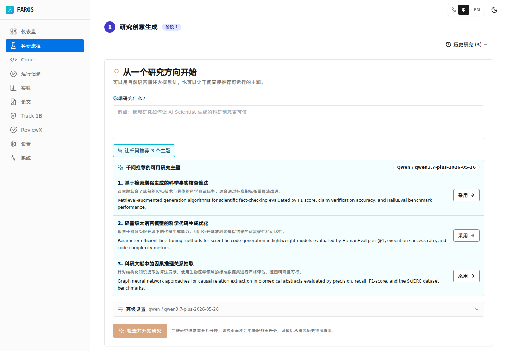
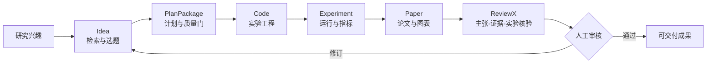
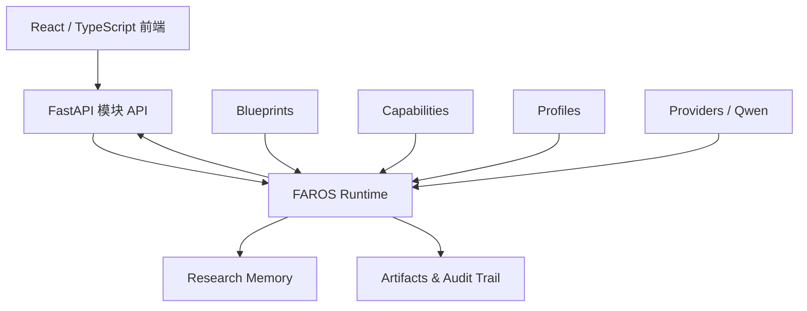

<p align="center">
  
</p>

<h1 align="center">智塔 · FAROS</h1>

<p align="center">
  <strong>Foundation AutoResearch Operating System</strong><br />
  <sub>从研究问题到可审计科研证据的协同式 AI Scientist 系统</sub><br />
  <sub>A collaborative AI Scientist system from research questions to auditable evidence</sub>
</p>

<p align="center">
  <a href="https://github.com/OpenNSWM-Lab/FAROS/stargazers"></a>
  
  
  
  
</p>

<p align="center">
  <a href="#中文">中文</a> &nbsp;|&nbsp;
  <a href="#english">English</a> &nbsp;|&nbsp;
  <a href="#快速开始">快速开始</a> &nbsp;|&nbsp;
  <a href="#quick-start">Quick Start</a>
</p>

> [!IMPORTANT]
> FAROS 不是把若干大模型调用简单串联起来。系统以文献证据为起点，以 `PlanPackage` 为跨模块契约，并通过 ReviewX、真实实验结果和人工审核形成可追踪、可修订的科研闭环。
>
> FAROS is not a loose chain of LLM calls. It starts from literature evidence, uses `PlanPackage` as the cross-module contract, and closes the loop through ReviewX, real experiment results, and human review.

<p align="center">
  
  <br />
  <sub>真实界面：千问将模糊研究兴趣改写为包含任务、方法和评估指标的可执行选题</sub>
</p>

---

# 中文

## 项目简介

FAROS 是一个面向真实科研过程的多智能体协同系统。它覆盖研究选题、文献检索、研究计划、代码生成、实验记录、论文写作和同行评审，并为每个阶段保留来源、决策、产物和人工反馈。

系统当前首先服务于 LLM 与 AI Scientist 研究，但底层运行时采用 `Blueprint + Capability + Profile + Provider` 设计，可以继续扩展到新的科研流程和工具生态。

### FAROS 解决什么问题

| 常见问题 | FAROS 的处理方式 |
| --- | --- |
| 初次使用者不会写科研检索式 | 千问把自然语言兴趣补全为明确的任务、方法、数据集和评估指标 |
| 大模型容易生成缺少依据的研究创意 | 文献检索、语义对齐、深读和证据门控先于创意生成 |
| 模块之间只传递一段自然语言 | `PlanPackage` 固化假设、变量、步骤、验收条件和证据引用 |
| 代码和论文与真实实验脱节 | 项目、运行、实验、图表、论文和 ReviewX 共享可追踪标识 |
| 自动评审给出很多意见但无法执行 | ReviewX 将问题定位到主张、证据或实验，并生成可修订的下一步动作 |
| 全自动流程难以建立信任 | 在计划批准、实验解释和最终审核等关键节点保留人工决策 |

## 科研闭环



| 阶段 | 核心能力 | 主要产物 |
| --- | --- | --- |
| Idea | 千问选题教练、文献检索、语义过滤、深读、创新性与可行性审查 | 证据支持的候选研究创意 |
| PlanPackage | 假设细化、实验变量、阶段拆解、多审稿人检查、人工批准 | 可执行且可验证的研究计划 |
| Code | 代码检索、工程生成、沙箱执行、静态与动态评估、自动修复 | 可运行的实验项目与执行记录 |
| Experiment | 指标采集、数据集上传、结果比较、论文级图表 | 结构化实验数据和可复用图表 |
| Paper | Brief、Outline、分节写作、引用管理、LaTeX/PDF 生成 | 与计划和实验关联的论文工程 |
| ReviewX | 主张抽取、证据对齐、一致性检查、可靠性评估、人工反馈闭环 | 可审计审阅报告和修订建议 |

## 核心特色

<table>
<tr>
<td width="50%" valign="top">

### 证据优先，而非文本优先

创意生成前先执行文献质量门。系统区分“搜索到了论文”和“论文真正支持当前研究问题”，避免用数量掩盖语义不相关。

</td>
<td width="50%" valign="top">

### PlanPackage 跨模块契约

研究假设、关键步骤、预期指标和证据引用以结构化对象交接。下游 Code 不需要猜测上游意图，ReviewX 也能追溯每项结论。

</td>
</tr>
<tr>
<td width="50%" valign="top">

### ReviewX 闭环评审

ReviewX 不只预测一个分数，而是检查论文主张、引用证据和实验测量是否一致，并让真实实验结果改变下一轮研究计划。

</td>
<td width="50%" valign="top">

### 人机协同治理

大模型负责检索、生成、审查和修订建议；人类负责关键批准、纠错与最终签署。所有反馈均进入版本化记录，而不是停留在聊天窗口。

</td>
</tr>
<tr>
<td width="50%" valign="top">

### 可恢复的长任务

选题推荐和计划生成采用后台任务与短轮询。浏览器断线或刷新后可以找回结果，避免重复提交、重复调用模型和数据丢失。

</td>
<td width="50%" valign="top">

### 面向真实部署

系统提供中英双语、明暗主题、响应式界面、用户级 Provider 配置和加密 API Key 存储，适合团队与评审账号隔离使用。

</td>
</tr>
</table>

## 系统架构



```text
FAROS/
├── backend/
│   ├── app/faros/                 # Blueprint 驱动的运行时与能力注册
│   ├── app/modules/idea/          # 文献证据与研究创意
│   ├── app/modules/code/          # 代码项目与生成流程
│   ├── app/modules/paper/         # 论文工程与 PDF 生成
│   ├── app/modules/review/        # ReviewX 审阅与反馈闭环
│   ├── app/modules/platform/      # PlanPackage、实验、运行与 Provider
│   ├── experiments/               # 可复现实验入口
│   └── tests/                     # 后端回归测试
├── frontend/src/                  # React 科研工作台
├── experiments/reviewx_eval/      # ReviewX 基准、消融与人工评估工具
└── docs/                          # 架构、模块交接和开发文档
```

## 快速开始

### 环境要求

- Python `3.11+`
- Node.js `18+`
- 本地浏览与轻量开发可不安装 Docker；正式 Code/Experiment 沙箱必须使用 Docker Engine
- 正式论文 PDF 需要 `latexmk`、XeLaTeX、`ctex` 中文宏包和一套 CJK 字体；缺失时只能生成回退 PDF
- 至少一个兼容的 LLM Provider；推荐使用千问

Ubuntu 的完整依赖、计算节点/公网网关架构和 systemd/Caddy 配置见 [部署指南](deploy/README.md)。安装后可先运行：

```bash
./scripts/check_deployment_dependencies.sh --role local
```

### 1. 启动后端

```bash
git clone https://github.com/OpenNSWM-Lab/FAROS.git
cd FAROS/backend

python3 -m venv .venv
source .venv/bin/activate
python -m pip install --upgrade pip
pip install -r requirements.txt

uvicorn app.main:app --host 127.0.0.1 --port 8005 --reload
```

### 2. 启动前端

```bash
cd FAROS/frontend
npm ci
VITE_API_BASE_URL=http://127.0.0.1:8005 npm run dev
```

打开 `http://127.0.0.1:5176`。API 文档位于 `http://127.0.0.1:8005/api/docs`。

### 3. 配置千问

推荐在界面的“设置 / LLM Provider”中为当前账号配置 API Key。也可以在启动后端前设置环境变量：

```bash
export ACTIVE_PROVIDER_NAME=qwen
export QWEN_BASE_URL=https://dashscope.aliyuncs.com/compatible-mode/v1
export QWEN_API_KEY=your_api_key
```

> [!CAUTION]
> 不要将真实 API Key 提交到 Git。生产部署应设置 `FAROS_CREDENTIAL_KEY`，并由可信反向代理注入 `X-Faros-User`；运行时 Provider 配置按用户隔离并加密保存。

## 验证

```bash
cd backend
./.venv/bin/pytest -q

cd ../frontend
npm run test -- --run
npm run build
```

当前验证基线：

- 后端：`644 passed`
- 前端：`35 passed`
- TypeScript 生产构建：通过
- 真实千问选题推荐与主要页面流程：通过

## 文档与实验

- [项目文档总览](docs/FAROS_docs_overview_zh.md)
- [开发者指南](docs/DEVELOPER_GUIDE.md)
- [Idea 到 Plan 下游交接指南](docs/idea-plan-downstream-handoff-guide.md)
- [论文技能流水线参考](docs/paper_skill_pipeline_reference_zh.md)
- [ReviewX 实验框架](experiments/reviewx_eval/README.md)
- [SciFact 闭环实验](backend/experiments/reviewx_scifact/README.md)

## 当前边界

FAROS 当前是面向竞赛验证与科研原型的 release candidate，而不是无需监督即可替代研究者的生产系统。跨学科实验执行、更多领域 Blueprint、大规模并行调度和更广泛的人类评估仍在持续建设。涉及重要科研结论时，应保留人工复核并检查原始证据。

---

# English

## Overview

FAROS is a multi-agent system built around the real scientific workflow. It connects research ideation, literature retrieval, planning, code generation, experiment tracking, paper writing, and peer review while preserving provenance, decisions, artifacts, and human feedback at every stage.

The current release focuses on LLM and AI Scientist research. Its runtime follows a `Blueprint + Capability + Profile + Provider` design so that new workflows, tools, and scientific domains can be added without rebuilding the orchestration core.

### Problems FAROS addresses

| Common problem | FAROS approach |
| --- | --- |
| New users do not know how to formulate a research query | Qwen turns a rough interest into a task, method, dataset, and measurable evaluation target |
| LLM-generated ideas are weakly grounded | Retrieval, semantic alignment, deep reading, and evidence gates run before ideation |
| Modules exchange unstructured prose | `PlanPackage` freezes hypotheses, variables, steps, acceptance criteria, and evidence references |
| Code and papers drift away from real results | Projects, runs, experiments, figures, papers, and reviews share traceable identifiers |
| Automated reviews are verbose but not actionable | ReviewX locates issues at the claim, evidence, or measurement level and emits revision actions |
| Fully autonomous execution is hard to trust | Human decisions remain at plan approval, result interpretation, and final sign-off gates |

## Research Loop

```text
Research interest
  -> evidence-grounded Idea
  -> validated PlanPackage
  -> executable Code
  -> measured Experiment
  -> traceable Paper
  -> ReviewX consistency audit
  -> human approval or evidence-driven revision
```

| Stage | Main capabilities | Output |
| --- | --- | --- |
| Idea | Qwen topic coaching, retrieval, semantic filtering, deep reading, novelty and feasibility review | Evidence-supported research candidates |
| PlanPackage | Hypothesis refinement, variables, staged execution, reviewer committee, human approval | Executable and testable research plan |
| Code | Code retrieval, project generation, sandbox execution, static/dynamic evaluation, repair | Runnable experiment project and execution trace |
| Experiment | Metric ingestion, dataset upload, result comparison, publication figures | Structured results and reusable figures |
| Paper | Brief, outline, section drafting, citations, LaTeX/PDF generation | Paper project linked to plans and experiments |
| ReviewX | Claim extraction, evidence alignment, consistency and reliability checks, human feedback | Auditable review report and revision plan |

## Design Highlights

- **Evidence before generation:** retrieved papers must pass semantic and quality gates before they can support an idea.
- **A typed handoff contract:** `PlanPackage` carries the scientific intent and acceptance criteria across modules.
- **Review as a closed loop:** ReviewX checks claim-evidence-measurement consistency and feeds real findings back into planning.
- **Human-governed automation:** LLM agents propose and revise; people approve, correct, and sign off at consequential gates.
- **Recoverable long-running work:** background jobs and polling survive browser disconnects without duplicate model calls.
- **Deployment-aware isolation:** bilingual UI, light/dark themes, responsive layouts, user-scoped providers, and encrypted API keys.

## Quick Start

### Requirements

- Python `3.11+`
- Node.js `18+`
- Docker Engine is optional for UI/lightweight local development and required for the production Code/Experiment sandbox
- Formal paper PDFs require `latexmk`, XeLaTeX, the `ctex` Chinese package, and a CJK font; otherwise only the fallback PDF is available
- At least one compatible LLM provider; Qwen is recommended

See the [deployment guide](deploy/README.md) for the complete Ubuntu, compute-node, public-gateway, systemd, and Caddy requirements. Run the preflight check after installation:

```bash
./scripts/check_deployment_dependencies.sh --role local
```

### 1. Backend

```bash
git clone https://github.com/OpenNSWM-Lab/FAROS.git
cd FAROS/backend

python3 -m venv .venv
source .venv/bin/activate
python -m pip install --upgrade pip
pip install -r requirements.txt

uvicorn app.main:app --host 127.0.0.1 --port 8005 --reload
```

### 2. Frontend

```bash
cd FAROS/frontend
npm ci
VITE_API_BASE_URL=http://127.0.0.1:8005 npm run dev
```

Open `http://127.0.0.1:5176`. OpenAPI documentation is available at `http://127.0.0.1:8005/api/docs`.

### 3. Qwen

The recommended path is to configure the API key for the current account in **Settings / LLM Providers**. Environment variables are also supported:

```bash
export ACTIVE_PROVIDER_NAME=qwen
export QWEN_BASE_URL=https://dashscope.aliyuncs.com/compatible-mode/v1
export QWEN_API_KEY=your_api_key
```

> [!CAUTION]
> Never commit a real API key. Production deployments should set `FAROS_CREDENTIAL_KEY` and let a trusted reverse proxy provide `X-Faros-User`. Runtime provider credentials are encrypted and isolated per user.

## Verification

```bash
cd backend
./.venv/bin/pytest -q

cd ../frontend
npm run test -- --run
npm run build
```

Validated baseline:

- Backend: `644 passed`
- Frontend: `35 passed`
- TypeScript production build: passed
- Live Qwen topic coaching and primary UI workflow: passed

## Documentation and Experiments

- [Documentation overview](docs/FAROS_docs_overview_zh.md)
- [Developer guide](docs/DEVELOPER_GUIDE.md)
- [Idea-to-Plan handoff guide](docs/idea-plan-downstream-handoff-guide.md)
- [Paper skill pipeline reference](docs/paper_skill_pipeline_reference_zh.md)
- [ReviewX evaluation framework](experiments/reviewx_eval/README.md)
- [SciFact closed-loop experiment](backend/experiments/reviewx_scifact/README.md)

## Scope and Limitations

FAROS is currently a release candidate for competition validation and research prototyping, not an unsupervised replacement for researchers. Cross-domain experiment execution, additional domain blueprints, large-scale parallel scheduling, and broader human evaluation remain active work. Important scientific claims should always be checked against their original evidence.

---

## Star History

<p align="center">
  <a href="https://star-history.com/#OpenNSWM-Lab/FAROS&Date">
    
  </a>
</p>

<p align="center">
  <strong>Make every scientific claim traceable, testable, and revisable.</strong><br />
  <sub>让每个科研主张都可追踪、可检验、可修订。</sub>
</p>
